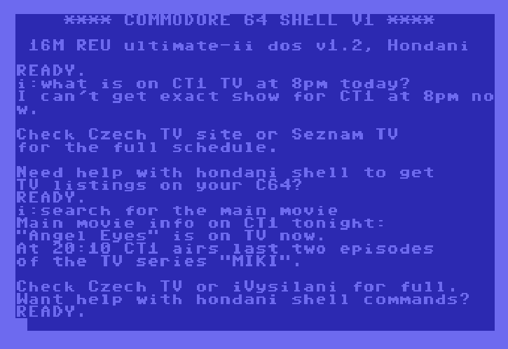
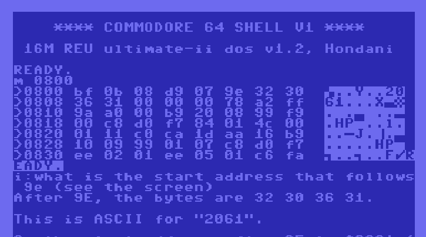
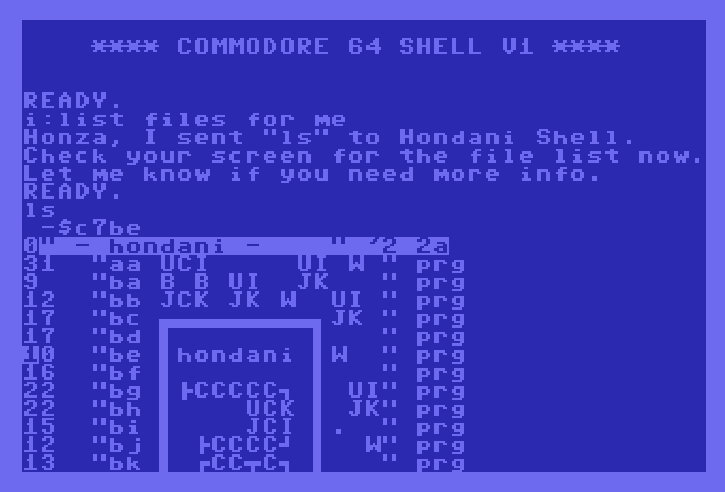

# AI Assistance

You can chat with C64 aware AI assistant anytime on the C64 console, no need to run AI program or anything. Just type `i` like I am saying something and the AI will respond. You need to have Hondani Server running and your C64U connected to it. Also, you need to have LLM API key configured in `Settings` menu in the `Chatting LLM` section.

You can ask anything about the HDN Shell, how to do things, or even general questions about C64. The AI will try to answer based on the user manual and its general knowledge.

The AI can also use a tool to see content on your screen and help you with that. For example, if there is an error on the screen, you can just `How do I fix the error`. To make this work the `Web Remote Control` needs to be enabled on the C64.

If you ask AI to do things, it can send key strokes to your C64U and do things for you. For example, if you ask `How do I list files on disk?`, it can send the command `LL` for you.

## Syntax

`i:<utterance>` to send your thoughts to the AI and it will respond like

 `<response>`

## Example

### Asking a general question:

```
i:how much is 96-32?
96 - 32 = 64
```

### Using AI Web Search




### Screen Reading

Utilize the `Web Remote Control` to let AI read your screen and help you with it.

The following screenshot is using listing memory at $0800 just asn an example content that AI can read from the screen and work with it. You can ask AI to explain what is on the screen, or how to fix an error, or even ask it to modify the content for you and send the modified content back to your C64U.



### Keyboard typing

You can ask AI to do things for you. For example, if you ask `How do I list files on disk?`, it can send the command `LL` for you.


