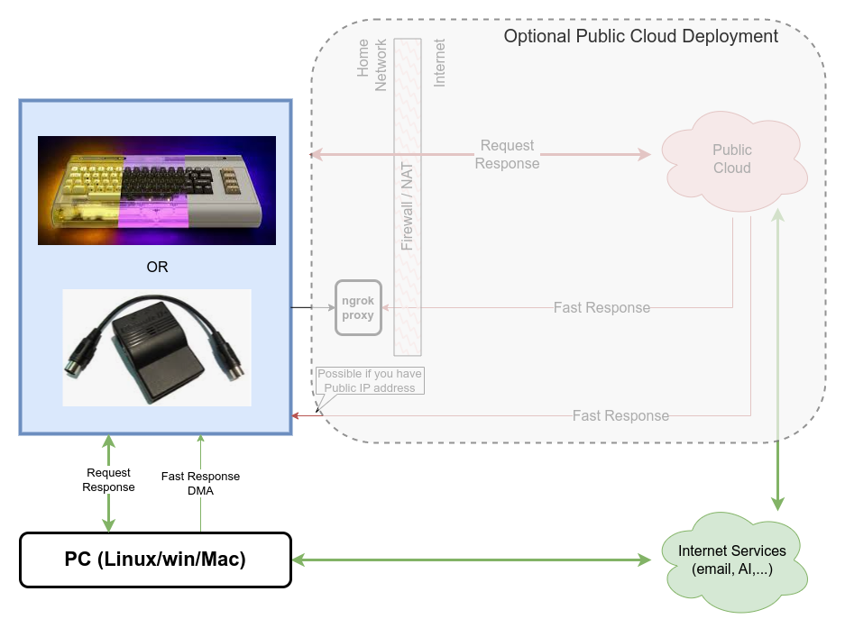
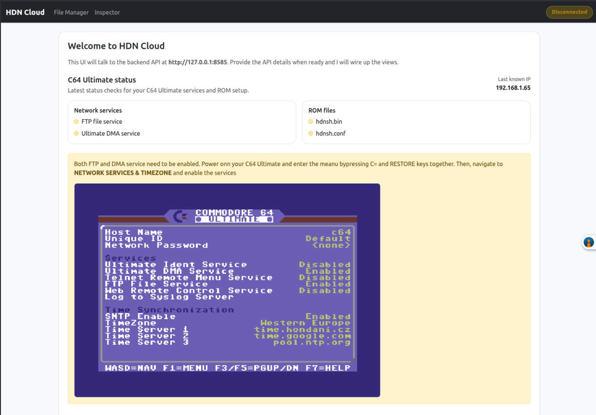

# Networking and HDN Server Integration

In many cases when C64 is being connected to other machines, it is considered using old-style modems and BBSes. While this is a valid use case, and we can find a lot information and joy doing this, thinking about the C64U as a modern machine requires to connect it using modern networking protocols to the **HDN Server** — a companion app running on your own PC or Mac — and through it down to the Internet that offers a lot of modern services that one already expects from a modern machine. This chapter describes the networking and server integration features of HDN Shell RR.

## Communication Design

For privacy and data protection, the server runs as your own private instance on your own machine — there is no hosted service and no account. This requires [installation of the HDN Server on your PC](installation.md).

## HDN Server Components

The C64U uses the Ultimate Command Interface (UCI) network target to send commands to the HDN Server on **TCP port 6464**. The server processes these commands and dispatches them to the appropriate command handlers (AI chat, help, Python eval, CSDB, network drive) and console apps. The server then responds either directly to the request or by making a new call to the C64U DMA service.

Using the UCI request and response mechanism allows for "limited" communication speed which is still way faster than using the serial port and modems. It is somewhere on par with parallel user port communication (like WiC64).

If the server needs to send a significant amount of data to the C64U, it can use the DMA service which automagically transfers data straight into the memory. The speed can be up to ~1MB/s. This allows for streaming video, for example. File transfers between the server and the Ultimate storage use the C64U's built-in FTP server.

## Server Web UI

The server also runs a web user interface on **port 8064** (open `http://localhost:8064` on the machine running the server). It offers:

- **Status** — connection state of your C64U, with guided setup steps.
- **Settings** — LLM configuration for the chat and coding assistants (provider, endpoint, model, API key — any OpenAI-compatible endpoint works, including a local Ollama), web-search API key, Telegram API credentials, and optional CSDB login.
- **[File Manager](file-manager.md)** — browse, upload, download, run, and mount files on the Ultimate storage.
- **Screen** — live video/audio stream of the machine (Ultimate 64) with remote keyboard input.
- **Inspector** — a C64 memory inspector (requires the `Web Remote Control` service enabled on the C64U).
- **Docs** — this user manual.
- **Update** — check for and self-install server updates.

