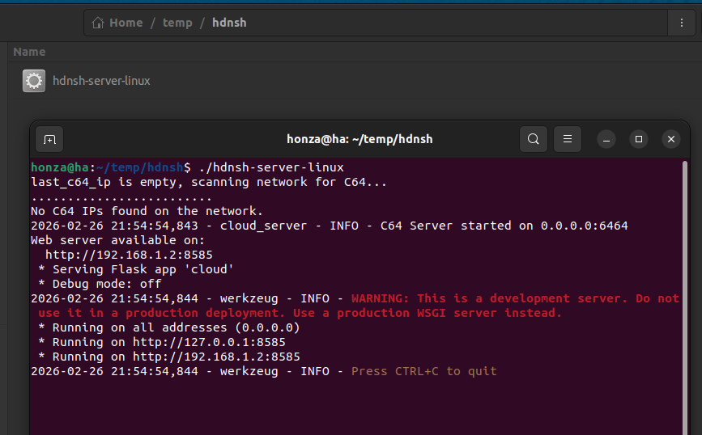

# How do I Install it?

The sweet spot is to use the C64 Ultimate or 1541 Ultimate cartridge with networking capabilities. However, if you do no have one there are other options. See below.

In a nutshell, this guide will help you set up your C64 Ultimate for full functionality, that includes:

1. Set BASIC ROM in the Ultimate menu.
2. Enable REU (recommended size 16MB) in the Ultimate menu.
3. Connect your Ultimate to the network (Ethernet or WiFi).
4. Run the HDN Shell server on your PC (optional yet very recommended for extended features).

## Easy Install

This process is simplified and automated using the server process.

### 1. Download the latest `hdnsh-server` from the [Releases](https://github.com/slesinger/hdnshell/releases/latest) page.
- [Linux](https://github.com/slesinger/hdnshell/releases/latest/download/hdnsh-server-linux)
- [Mac](https://github.com/slesinger/hdnshell/releases/latest/download/hdnsh-server-mac)
- [Windows](https://github.com/slesinger/hdnshell/releases/latest/download/hdnsh-server-win)

### 2. Run the `hdnsh-server` on your PC

> Make sure the file is executable (on Linux/Mac you may need to run:

<div style="position: relative; display: inline-block; width: 100%; margin-bottom: 1em;">
    <button onclick="navigator.clipboard.writeText('chmod +x hdnsh-server-linux')" style="position: absolute; top: 4px; right: 4px; z-index: 1; background: #eee; border: none; border-radius: 4px; cursor: pointer; padding: 2px 6px;">
        📋
    </button>
    <pre style="margin-top: 0; padding-top: 2em;"><code>chmod +x hdnsh-server-linux</code></pre>
</div>

It is better to run the server from terminal to see the logs and any potential errors.



The process will scan your local network and look for your C64 Ultimate. It is __perfectly fine__ if you see `No C64 IPs found on the network.` message. It just means that your C64U is not connected, is powered off, or is not configured to connect to the network. You can proceed with the next steps and repeat the scan comfortably later.

### 3. Open Web UI

Open your browser and navigate to 

<div style="position: relative; display: inline-block; width: 100%; margin-bottom: 1em;">
    <button onclick="navigator.clipboard.writeText('http://localhost:8064')" style="position: absolute; top: 4px; right: 4px; z-index: 1; background: #eee; border: none; border-radius: 4px; cursor: pointer; padding: 2px 6px;">
        📋
    </button>
    <pre style="margin-top: 0; padding-top: 2em;"><code>http://localhost:8064</code></pre>
</div>

You should see the HDN Shell Web UI.


### 4. Follow instructions in the web UI to set up your C64 Ultimate

Depending on the status of your C64U, you will need to ensure the following. But do not worry the main page will try to detect what needs to be done next.

- Power on your C64 Ultimate and connect it to the network (Ethernet or WiFi). The beautiful printed manual is your friend here.

At this stage IP address should be discoverable. Use the `Find you C64U` button in top right corner of the web UI to scan your network. Alternatively, you can restart the `hdnsh-server` to trigger the scan in the terminal.

- Enable network services 

At least `FTP file service` and `Ultimate DMA Service` should be enabled. The former allows you to transfer files between your PC and C64, while the latter enables to control the C64U.


- Set HDN Shell as BASIC ROM

If the above is enabled correctly, you should see the `Set HDN Shell as BASIC ROM` button in the web UI. Click it and wait for the process to complete. This will automatically download the latest `hdnsh.bin` from the releases and set it as BASIC ROM in your Ultimate.

Here is download link for the latest `hdnsh.bin` in case you want to do it manually:
https://github.com/slesinger/hdnshell/releases/latest/download/hdnsh.bin


## Using C64 Ultimate or 1541 Ultimate

## Alternative Options 

### BASIC ROM Replacement (manual install with Ultimate)

1. Download the latest `hdnsh.bin` from the [Releases](https://github.com/slesinger/hdnshell/releases) page. Then place it into the `roms` folder in Ultimate `flash` partition. Next, in the Ultimate menu, go to `Settings` -> `Memory & ROMs` and set the `BASIC ROM` to `hdnsh.bin`.

2. Enable REU (recommended size 16MB) in the Ultimate menu under `Settings` -> `Memory & ROMs` -> `RAM Expansion Unit` set to Enabled and set `Size` to 16MB.

3. Enable `Command Interace` in the same menu to give C64 access to Ultimate features like filesystem and networking.

4. Enter `Network Services & Timezone` menu and enable `Ultimate DMA Service` (for fast transfers from cloud). Do not forget to configure your network settings (Ethernet or WiFi) as needed.

5. Save the settings and reboot your C64.

### Without C64 Ultimate

You can benefit from using a general RAM expansion unit (REU). Without Ultimate there is no alternative networking interface support as of now, so cloud features will not be available. Support the new Commodore by getting the C64U now 🙂 and continue the setup as described above.

## How do I Verify it Works?

After switching on your C64, you should see a command prompt like this:

```
    **** COMMODORE 64 SHELL V1 ****

 16M REU ULTIMATE-II DOS V1.2, HONDANI
```

If first line is displayed like this, the BASIC ROM has been enabled correctly.

The second line depends on your hardware configuration. If `Command Interace` has been enabled correctly, you should see `ULTIMATE-II DOS V1.2` part.

You can use `info` command to display more detailed information about your setup. The `@` command shows the status of the last operation, like connecting to cloud server.
