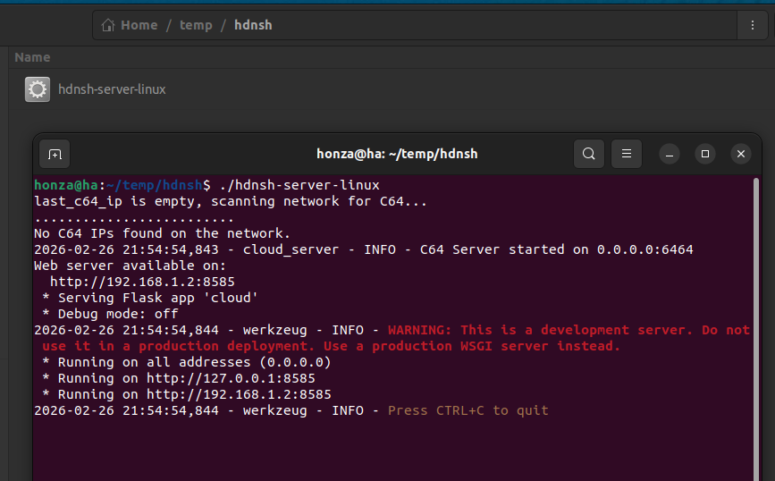
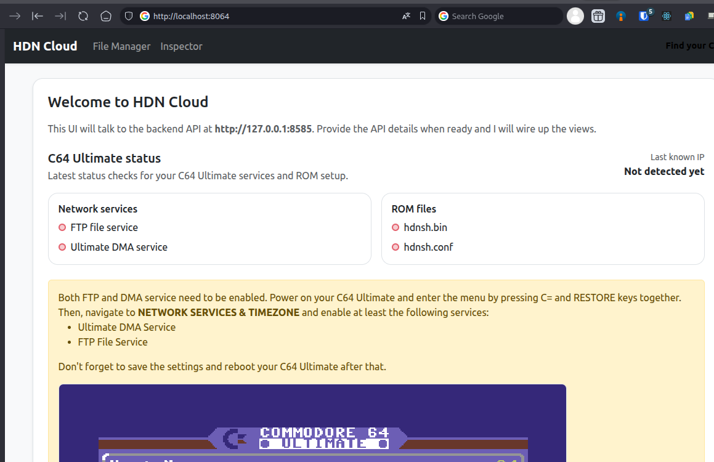
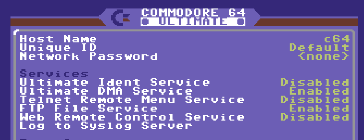

# Getting Started - Easy Install

### 1. Download the latest `hdnsh-server` from the [Releases](https://github.com/slesinger/hdnshell/releases/latest) page.
- [Linux](https://github.com/slesinger/hdnshell/releases/latest/download/hdnsh-server-linux)
- [Mac](https://github.com/slesinger/hdnshell/releases/latest/download/hdnsh-server-mac)
- [Windows](https://github.com/slesinger/hdnshell/releases/latest/download/hdnsh-server-win)

### 2. Run the `hdnsh-server` on your PC

> Make sure the file is executable (on Linux/Mac you may need to run:

```
chmod +x hdnsh-server-linux
```

It is better to run the server from terminal to see the logs and any potential errors.



The process will scan your local network and look for your C64 Ultimate. It is __perfectly fine__ if you see `No C64 IPs found on the network.` message. It just means that your C64U is not connected, is powered off, or is not configured to connect to the network. You can proceed with the next steps and repeat the scan comfortably later.

### 3. Open Web UI

Open your browser and navigate to 

```
http://localhost:8064
```

You should see the HDN Shell Web UI.




### 4. Follow instructions in the web UI to set up your C64 Ultimate

Depending on the status of your C64U, you will need to ensure the following. The main page will try to detect what needs to be done next.

- Power on your C64 Ultimate and connect it to the network (Ethernet or WiFi). The beautiful printed manual is your friend here.

At this stage IP address should be discoverable. Use the `Find you C64U` button in top right corner of the web UI to scan your network. Alternatively, you can restart the `hdnsh-server` to trigger the scan in the terminal.

- Enable network services 

At least `FTP file service` and `Ultimate DMA Service` should be enabled. The former allows you to transfer files between your PC and C64, while the latter enables to control the C64U.



- Set HDN Shell as BASIC ROM

If the above is enabled correctly, you should see the `Set HDN Shell as BASIC ROM` button in the web UI. Click it and wait for the process to complete. This will automatically download the latest `hdnsh.bin` from the releases and set it as BASIC ROM in your Ultimate.

Here is download link for the latest `hdnsh.bin` in case you want to do it manually:
https://github.com/slesinger/hdnshell/releases/latest/download/hdnsh.bin

