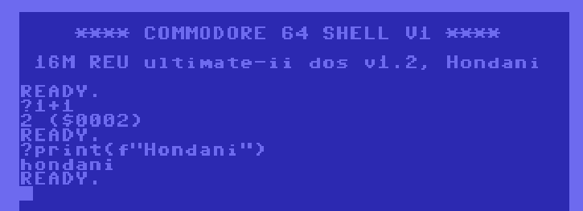

# PySIC, Python Expressions from the C64 Prompt

PySIC gives you the option to execute Python expressions on the HDN Server, straight from the C64 command line. It is not a replacement for BASIC — BASIC is right there at the same prompt — it is a complement: instant access to modern math, conversions, and live C64 memory access via `ram`, without writing a program.

`:` prefix indicates that the following text will be sent to the Python Eval Handler on the server, executed, and the result (or printed output) returned and displayed on the C64 command line.

For security reasons, only a limited set of Python built-in functions and math operations are allowed. You can get an idea of what is possible by looking at the [source code](https://github.com/slesinger/hdnshell/blob/master/cloud/handlers/python_eval_handler.py).

## Commands

### Basic Math
- `+`, `-`, `*`, `/`, `//`, `%`, `**`
- `abs()`, `min()`, `max()`, `sum()`
- `divmod()`, `pow()`, `round()`

### Conversions
- `hex()` - Decimal to hex
- `bin()` - Decimal to binary
- `oct()` - Decimal to octal
- `int()`, `float()`, `str()`
- `chr()`, `ord()` - Character conversions

### Number Conversion

`:0x2000` -> `8192 ($2000)`

`:hex(49152)` -> `0xc000`

`:bin(0xea)` -> `0b11101010`

### Math Functions
- `sqrt()`, `pi`, `e`
- `sin()`, `cos()`, `tan()`
- `log()`, `log10()`, `exp()`
- `floor()`, `ceil()`

### Import

`import` works, but only for a whitelisted set of safe standard-library modules: `math`, `random`, `string`, `datetime`, `time`, `statistics`, `itertools`, `functools`, `re`, `json`, `textwrap`. Anything else (`os`, `sys`, `subprocess`, ...) is rejected.

`:import random; print(random.randint(1, 6))` -> rolls a die

`:import statistics; print(statistics.mean([2, 4, 6]))` -> `4`

### C64 Memory Access

`ram` is a live view onto the C64's own RAM, read and written over the network in real time. It behaves exactly like a Python `bytes`/`bytearray`, including slicing — addresses are always hex, written the normal Python way (`0x` prefix required; a bare `0400` is a syntax error, same as in real Python).

`:ram[0xd020]` -> `1 ($0001)` (reads one byte, e.g. the border colour)

`:ram[0xd020] = 1` -> `OK` (sets the border colour to white)

`:print(ram[0x0400:0x0800])` -> prints the raw bytes of the first quarter of screen memory (a Python slice is half-open: end address excluded, matching `ram[a:b]` to `b - a` bytes)

`:ram[0x0400:0x0410] = [32] * 16` -> `OK` (blanks the first line of the screen; the right-hand side must supply exactly as many bytes as the slice covers)
