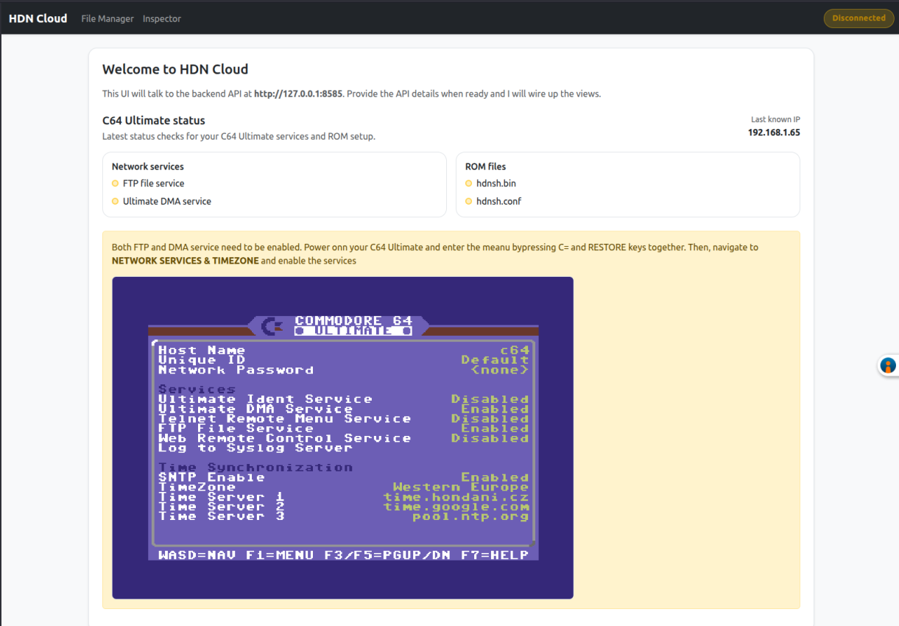

# Networking and Cloud Integration

In many cases when C64 is being connected to other machines, it is considered using old-style modems and BBSes. While this is a valid use case, and we can find a lot information and joy doing this, thinking about the C64U as a modern machine requires to connect it using modern networking protocols to the server (HDN Cloud, your private instance) and through it down to the Internet that offers a lot of modern services that one already expects from a modern machine. This chapter describes the networking and cloud integration features of HDN Shell.

## Communication Design

For privacy and data protection is always easier to have a private instance of the cloud server running on your own machine. This requires [installation of the HDN Cloud Server on your PC](installation.md).

> The Public Cloud deployment is currently on hold to gain user feedback from installing the server locally on user's PCs.

## HDN Cloud Components

The C64U uses Ultimate Command Interface (UCI) to send commands to the HDN Cloud Server using TCP port 8064. The server processes these commands and dispatches them to appropriate command handlers. The server then responds either back to the request or by making a new call to the C64U DMA service.

Using the UCI request and response mechanism allows for "limited" communication speed which is still way faster than using the serial port and modems. It is somewhere on par with parallel user port communication (like WiC64)

If the server needs to send  significant amount of data to the C64U, it can use the DMA service which automagically transfers data straight into the memory. The speed can be up to ~1MB/s. This allows for streaming video, for example.

The server application also offers a web user interface that allows to monitor the status of the C64U, manage files and lots of other things.

